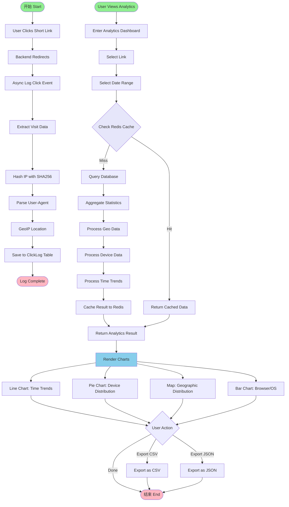

# Picture 2-10: Business Process Models of Click Statistics and Analysis
# 图 2-10：点击统计与分析的业务流程模型图



## 流程说明

### 📊 点击日志记录流程（异步）

#### 1. 点击事件触发
当用户访问短链接时（如 `https://tinybridge.link/aB3xY9`）：

1. **立即重定向**：后端从 Redis 缓存获取目标 URL，执行 302 重定向（< 100ms）
2. **异步日志**：不阻塞重定向，后台异步记录点击事件

#### 2. 数据采集与处理

```javascript
// 采集的数据
{
  link_id: 12345,
  clicked_at: '2025-01-15T14:32:10Z',
  ip_hash: SHA256(ip + daily_salt),  // 隐私保护
  user_agent: 'Mozilla/5.0...',
  referrer: 'https://weixin.qq.com',
  country: 'China',     // GeoIP 解析
  city: 'Guangzhou',    // GeoIP 解析
  device_type: 'mobile', // UA 解析
  browser: 'Chrome',    // UA 解析
  os: 'Android'         // UA 解析
}
```

#### 3. IP 隐私保护
- **SHA256 哈希**：IP + 每日轮换的 Salt
- **不可逆**：无法还原原始 IP
- **符合 GDPR/CCPA**：满足隐私法规要求
- **保留地理信息**：GeoIP 在哈希前解析

#### 4. GeoIP 地理定位
使用 `geoip-lite` 或 `@maxmind/geoip2-node`：
```javascript
const geoip = require('geoip-lite')
const geo = geoip.lookup('8.8.8.8')
// { country: 'US', region: 'CA', city: 'Mountain View' }
```

---

### 📈 数据分析查询流程

#### 1. 查询触发
用户进入分析仪表板，选择：
- **目标链接**：单个链接 or 全部链接
- **时间范围**：最近 7 天 / 30 天 / 自定义范围

#### 2. 缓存策略（Redis）
```
缓存 Key: analytics:link:{link_id}:range:{start}-{end}
TTL: 1 小时
```

- **缓存命中**：直接返回（< 50ms）
- **缓存未命中**：查询数据库 → 聚合计算 → 缓存结果

#### 3. 数据聚合

| 聚合维度 |统计指标 | 图表类型 |
|----------|----------|----------|
| **时间趋势** |每小时/每天点击数 | 折线图 |
| **地理分布** |国家/城市点击数 | 地图 + 饼图 |
| **设备类型** |Mobile/Desktop/Tablet 占比 | 饼图 |
| **浏览器** |Chrome/Safari/Edge 占比 | 柱状图 |
| **操作系统** | Windows/macOS/Android/iOS | 柱状图 |
| **来源分析** |Direct/Social/Search 占比 | 饼图 |#### 4. 图表渲染（ECharts/Chart.js）

```javascript
// 时间趋势折线图示例
{
  type: 'line',
  data: {
    labels: ['01-10', '01-11', '01-12', ...],
    datasets: [{
      label: '点击数 Clicks',
      data: [245, 389, 512, ...]
    }]
  }
}
```

#### 5. 数据导出
- **CSV 格式**：便于 Excel 分析
- **JSON 格式**：便于程序处理

---

### ⚡ 性能优化

| 优化策略 |效果 |
|----------|------|
| **异步日志** |不阻塞重定向，保持 < 100ms 响应 |
|**Redis 缓存** | 聚合数据缓存 1h，减少 DB 查询 |
| **数据库索引** |`link_id` + `clicked_at` 复合索引 |
|**批量插入** | 每 5 秒批量写入日志，减少 DB 连接 |---

### 🔒 隐私合规

| 措施 |说明 |
|------|------|
| **IP 哈希** |SHA256 + 每日轮换 Salt |
|**数据最小化** | 不存储个人身份信息 |
| **数据留存** |Click logs 保留 90 天 |
|**用户权利** | 支持数据导出、删除请求 |
