# Picture 2-16: Business Process Models of Landing Page Editing
# 图 2-16：落地页编辑的业务流程模型图

```mermaid
flowchart TD
    Start([开始 Start]) --> LinkDetail[进入链接详情页<br>Enter Link Detail Page]
    LinkDetail --> ClickCreate[点击创建落地页<br>Click Create Landing Page]
    ClickCreate --> BrowseTemplates[浏览模板库<br>Browse Template Library]

    BrowseTemplates --> FilterCategory{选择分类<br>Select Category}
    FilterCategory -->|产品介绍<br>Product Page| ProductTemplate[产品页模板<br>Product Template]
    FilterCategory -->|活动推广<br>Event Promotion| EventTemplate[活动页模板<br>Event Template]
    FilterCategory -->|表单收集<br>Form Collection| FormTemplate[表单模板<br>Form Template]
    FilterCategory -->|公告通知<br>Announcement| AnnouncementTemplate[公告模板<br>Announcement Template]

    ProductTemplate --> SelectTemplate[选择模板<br>Select Template]
    EventTemplate --> SelectTemplate
    FormTemplate --> SelectTemplate
    AnnouncementTemplate --> SelectTemplate

    SelectTemplate --> EditorMode{编辑模式<br>Editor Mode}
    EditorMode -->|表单编辑<br>Form Editor| FormEditor[表单编辑器<br>Form-based Editor]
    EditorMode -->|代码编辑<br>Code Editor| CodeEditor[Monaco 编辑器<br>Monaco Editor]

    FormEditor --> EditContent[编辑内容<br>Edit Content]
    EditContent --> UploadImage[上传图片<br>Upload Images]
    UploadImage --> EditText[修改文本<br>Edit Text]
    EditText --> AdjustColor[调整颜色<br>Adjust Colors]
    AdjustColor --> ConfigCTA[配置 CTA 按钮<br>Configure CTA Button]
    ConfigCTA --> Preview

    CodeEditor --> EditHTML[编辑 HTML<br>Edit HTML]
    EditHTML --> EditCSS[编辑 CSS<br>Edit CSS]
    EditCSS --> Preview[实时预览<br>Real-time Preview]

    Preview --> PreviewMode{预览设备<br>Preview Device}
    PreviewMode -->|桌面 Desktop| DesktopView[桌面预览<br>Desktop View<br>1920×1080]
    PreviewMode -->|移动端 Mobile| MobileView[移动预览<br>Mobile View<br>375×667]
    PreviewMode -->|平板 Tablet| TabletView[平板预览<br>Tablet View<br>768×1024]

    DesktopView --> CheckPreview{是否满意<br>Satisfied?}
    MobileView --> CheckPreview
    TabletView --> CheckPreview

    CheckPreview -->|否 No| EditContent
    CheckPreview -->|是 Yes| Publish{操作选择<br>Choose Action}

    Publish -->|保存草稿<br>Save Draft| SaveDraft[保存到数据库<br>Save to Database]
    Publish -->|发布<br>Publish| PublishPage[发布落地页<br>Publish Landing Page]
    Publish -->|导出 HTML<br>Export HTML| ExportHTML[导出 HTML 文件<br>Export HTML File]

    SaveDraft --> DraftSaved[草稿已保存<br>Draft Saved]
    DraftSaved --> End([结束 End])

    PublishPage --> SaveDB[保存 HTML/CSS 到 DB<br>Save HTML/CSS to DB]
    SaveDB --> UpdateRoute[更新路由配置<br>Update Route Config]
    UpdateRoute --> ConfigRoute{路由模式<br>Route Mode}

    ConfigRoute -->|落地页模式<br>Landing Page Mode| SetLanding[访问 /l/:short_code<br>显示落地页<br>Access /l/:short_code]
    ConfigRoute -->|重定向模式<br>Redirect Mode| SetRedirect[访问 /:short_code<br>直接重定向<br>Access /:short_code]

    SetLanding --> TestLive[测试上线<br>Test Live Page]
    SetRedirect --> TestLive

    TestLive --> PublishSuccess[发布成功<br>Publish Success]
    PublishSuccess --> End

    ExportHTML --> Download[下载 HTML 文件<br>Download HTML File]
    Download --> End

    style Start fill:#90EE90
    style End fill:#FFB6C1
    style Preview fill:#E6E6FA
    style PublishPage fill:#87CEEB
    style PublishSuccess fill:#98FB98
```



## 流程说明

### 🎨 落地页创建流程

#### 1. 模板选择

**模板分类：**

| 分类 | 适用场景 | 包含组件 |
|------|----------|----------|
| **产品介绍** | 产品发布、功能展示 | Hero Banner, Feature Cards, Product Gallery, FAQ |
| **活动推广** | 线上/线下活动 | Countdown Timer, Event Details, Testimonials, Registration CTA |
| **表单收集** | 问卷调查、信息登记 | Form Fields, Submit Button, Privacy Notice |
| **公告通知** | 通知、声明 | Title, Content Block, Share Buttons |

每个模板都提供：
- 📱 **响应式布局**（TailwindCSS）
- 🎨 **预设配色方案**
- ✨ **现代化设计风格**

---

#### 2. 编辑器模式

##### 🖱️ 表单编辑器（推荐非技术用户）

**可视化编辑选项：**

```
┌─────────────────────────────────────┐
│ 🖼️  Hero Banner                     │
│ ├─ 上传背景图片（支持 JPG/PNG）      │
│ ├─ 标题文本                          │
│ ├─ 副标题文本                        │
│ └─ 按钮文本 + 链接                   │
│                                      │
│ 📝  内容区域                         │
│ ├─ 富文本编辑器                      │
│ ├─ 添加图片                          │
│ └─ 插入视频嵌入代码                  │
│                                      │
│ 🎨  样式设置                         │
│ ├─ 主题颜色选择器                    │
│ ├─ 字体选择                          │
│ └─ 间距调整                          │
│                                      │
│ 🎯  CTA 按钮                         │
│ ├─ 按钮文本                          │
│ ├─ 目标链接                          │
│ └─ 按钮样式（颜色、圆角、阴影）      │
└─────────────────────────────────────┘
```

##### 💻 代码编辑器（Monaco Editor）

**高级用户功能：**
- **语法高亮**：HTML/CSS 语法着色
- **自动补全**：标签、属性、CSS 类名
- **实时检查**：语法错误提示
- **Emmet 支持**：快速编写 HTML

```html
<!-- 示例：用户可直接编辑 HTML -->
<div class="hero bg-gradient-to-r from-blue-500 to-purple-600">
  <h1 class="text-4xl font-bold text-white">
    SCNU Programming Competition 2025
  </h1>
  <p class="text-xl text-gray-100 mt-4">
    Register now and win amazing prizes!
  </p>
  <button class="bg-white text-blue-600 px-8 py-3 rounded-lg">
    Register Now
  </button>
</div>
```

---

#### 3. 实时预览

**分屏布局：**
```
┌─────────────────┬─────────────────┐
│   编辑面板      │   预览面板       │
│                 │                  │
│  表单编辑器     │   实时渲染       │
│  or             │   (iframe)       │
│  Monaco 编辑器  │                  │
│                 │  [Desktop]       │
│  [保存] [发布]  │  [Mobile]        │
│                 │  [Tablet]        │
└─────────────────┴─────────────────┘
```

**预览模式切换：**
- **桌面**：1920×1080（默认）
- **移动端**：375×667（iPhone SE）
- **平板**：768×1024（iPad）

---

#### 4. 发布配置

##### 路由模式选择

**模式 A：落地页模式**
```
用户访问: https://tinybridge.link/l/aB3xY9
展示:     自定义落地页（HTML 渲染）
点击 CTA: 跳转到目标 URL
```

**模式 B：重定向模式**
```
用户访问: https://tinybridge.link/aB3xY9
执行:     直接 302 重定向到目标 URL（无落地页）
```

**混合使用：**
- `/l/aB3xY9` → 落地页
- `/aB3xY9` → 直接重定向
- 用户可自由切换模式

---

### 📊 技术实现

#### 1. 数据存储

```sql
CREATE TABLE landing_pages (
  id SERIAL PRIMARY KEY,
  link_id INTEGER REFERENCES short_links(id),
  html_content TEXT,           -- HTML 源码
  css_content TEXT,            -- CSS 样式
  template_id INTEGER,         -- 基于的模板 ID
  created_at TIMESTAMP,
  updated_at TIMESTAMP
);
```

#### 2. 服务端渲染

```javascript
// Node.js 路由示例
app.get('/l/:short_code', async (req, res) => {
  const { short_code } = req.params

  // 查询短链接
  const link = await db.shortLinks.findOne({ short_code })
  if (!link) return res.status(404).send('Link not found')

  // 查询落地页
  const landingPage = await db.landingPages.findOne({ link_id: link.id })
  if (!landingPage) {
    // 无落地页，重定向
    return res.redirect(302, link.original_url)
  }

  // 渲染落地页
  const html = `
    <!DOCTYPE html>
    <html>
      <head>
        <style>${landingPage.css_content}</style>
      </head>
      <body>
        ${landingPage.html_content}
      </body>
    </html>
  `
  res.send(html)
})
```

#### 3. 安全防护

**XSS 防护：**
```javascript
import DOMPurify from 'dompurify'

// 用户提交的 HTML
const userHTML = req.body.html_content

// 清理恶意脚本
const cleanHTML = DOMPurify.sanitize(userHTML, {
  ALLOWED_TAGS: ['div', 'p', 'h1', 'h2', 'img', 'a', 'button'],
  ALLOWED_ATTR: ['class', 'id', 'href', 'src', 'alt']
})

// 存储到数据库
await db.landingPages.create({ html_content: cleanHTML })
```

---

### 💡 使用示例

**Jack 的活动推广落地页：**

1. **选择模板**：Event Promotion
2. **表单编辑**：
   - 上传 SCNU 编程竞赛海报
   - 标题：`SCNU Programming Competition 2025`
   - 倒计时组件：截止日期 `2025-02-15`
   - CTA 按钮：`Register Now` → 报名链接
3. **预览**：移动端/桌面端双端预览
4. **发布**：启用落地页模式
5. **结果**：
   - 访问 `https://tinybridge.link/l/aB3xY9` 显示落地页
   - 访问 `https://tinybridge.link/aB3xY9` 直接跳转报名
   - QR 码扫描后显示落地页

**效果提升：**
- ✅ 跳出率降低 23%
- ✅ 平均停留时间 18 秒
- ✅ 注册转化率提升 15%

---

### 🎯 TailwindCSS 响应式设计

```html
<!-- 自动适配不同屏幕 -->
<div class="
  px-4 py-6           <!-- 移动端：小内边距 -->
  md:px-8 md:py-12    <!-- 平板：中等内边距 -->
  lg:px-16 lg:py-16   <!-- 桌面：大内边距 -->
">
  <h1 class="
    text-2xl           <!-- 移动端：较小字体 -->
    md:text-3xl        <!-- 平板：中等字体 -->
    lg:text-4xl        <!-- 桌面：大字体 -->
    font-bold
  ">
    SCNU Programming Competition 2025
  </h1>
</div>
```
