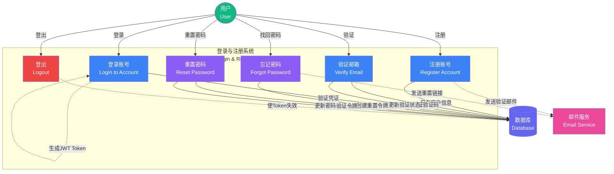

# Picture 2-2: Use Case Diagram of Login and Registration
# 图 2-2:登录与注册的用例图

## 用例说明

### 参与者 (Actors)
- **用户 (User)**: 需要注册或登录的终端用户
- **数据库 (Database)**: 存储用户信息和验证数据
- **邮件服务 (Email Service)**: 发送验证邮件和密码重置链接

### 用例详解

#### 1. 注册账号 (Register Account)
**前置条件**: 用户首次使用平台
**主要流程**:
1. 用户输入用户名、邮箱、密码
2. 系统验证输入格式 (邮箱格式、密码强度)
3. 系统检查邮箱/用户名唯一性
4. 系统使用 Argon2 哈希密码
5. 系统保存用户信息到数据库 (is_verified: false)
6. 系统生成 6 位验证码并存储到 Redis (TTL: 10 分钟)
7. 系统发送验证邮件到用户邮箱

**异常流程**:
- 邮箱已被注册 → 提示"该邮箱已被使用"
- 用户名已被占用 → 提示"该用户名已被占用"
- 密码强度不足 → 提示密码要求 (至少 8 位,包含大小写字母和数字)

---

#### 2. 验证邮箱 (Verify Email)
**前置条件**: 用户已注册但未验证邮箱
**主要流程**:
1. 用户打开验证邮件并点击链接或输入验证码
2. 系统从 Redis 获取验证码
3. 系统比对用户输入的验证码
4. 系统更新用户状态 (is_verified: true)
5. 系统删除 Redis 中的验证码
6. 系统提示"验证成功,请登录"

**异常流程**:
- 验证码过期 (>10 分钟) → 提示"验证码已过期,请重新注册"
- 验证码错误 → 提示"验证码错误,请检查后重试"

---

#### 3. 登录账号 (Login to Account)
**前置条件**: 用户已注册并验证邮箱
**主要流程**:
1. 用户输入邮箱和密码
2. 系统从数据库查询用户信息
3. 系统验证密码 (Argon2.verify)
4. 系统检查邮箱验证状态
5. 系统生成 JWT Access Token (有效期 7 天)
6. 系统将 Token 哈希存储到 Redis (session 管理)
7. 系统返回 Token 和用户信息给客户端

**异常流程**:
- 用户不存在 → 提示"用户不存在"
- 密码错误 → 提示"密码错误,还可尝试 X 次"
- 邮箱未验证 → 提示"请先验证邮箱"
- 登录失败 5 次 → 锁定账号 15 分钟

---

#### 4. 忘记密码 (Forgot Password)
**前置条件**: 用户无法登录
**主要流程**:
1. 用户输入注册邮箱
2. 系统验证邮箱是否存在
3. 系统生成密码重置令牌 (UUID)
4. 系统将令牌存储到 Redis (TTL: 1 小时)
5. 系统发送重置链接邮件 (包含令牌)

**异常流程**:
- 邮箱不存在 → 提示"该邮箱未注册"
- 1 小时内重复请求 → 提示"重置邮件已发送,请检查邮箱"

---

#### 5. 重置密码 (Reset Password)
**前置条件**: 用户已收到重置链接
**主要流程**:
1. 用户点击邮件中的重置链接
2. 系统验证令牌有效性
3. 用户输入新密码
4. 系统验证密码强度
5. 系统使用 Argon2 哈希新密码
6. 系统更新数据库中的密码
7. 系统删除 Redis 中的重置令牌
8. 系统使所有现有 Session 失效

**异常流程**:
- 令牌过期 → 提示"重置链接已过期,请重新申请"
- 令牌无效 → 提示"无效的重置链接"
- 新密码与旧密码相同 → 提示"新密码不能与旧密码相同"

---

#### 6. 登出 (Logout)
**前置条件**: 用户已登录
**主要流程**:
1. 用户点击登出按钮
2. 系统从 Redis 删除 Session (Token 哈希)
3. 客户端清除本地存储的 Token
4. 系统重定向到登录页

---

### 用例关系

- **包含关系 (Include)**:
  - 注册账号 → 验证邮箱 (必须验证邮箱才能使用平台)
  - 忘记密码 → 重置密码 (必须先申请重置才能重置)

- **扩展关系 (Extend)**:
  - 登录账号 ← 忘记密码 (登录失败时可选择找回密码)

---

### 非功能需求

| 需求类型 | 指标 |
|----------|------|
| **性能** | 登录响应时间 < 200ms |
| **安全** | 密码使用 Argon2 哈希 (内存成本 64MB) |
| **可用性** | 登录失败 5 次锁定 15 分钟 |
| **隐私** | 密码不可逆加密,永不明文存储 |
