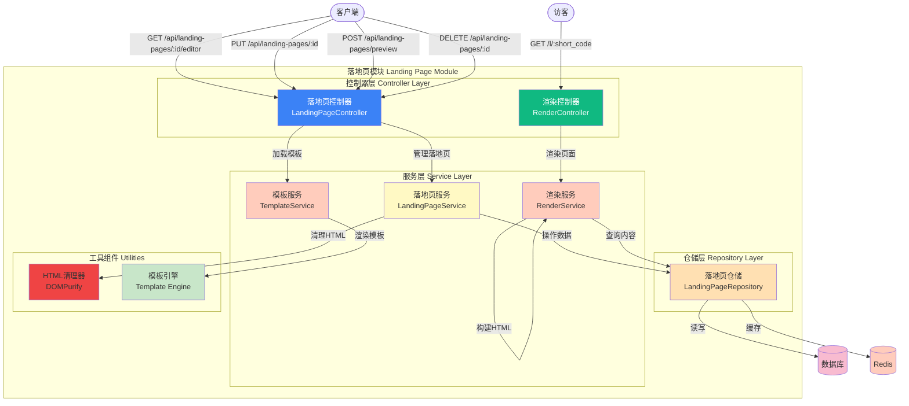

# Picture 3-12: Landing Page Module Diagram
# 图 3-12:落地页模块图

## API 端点

| 方法 | 路径 | 说明 |
|------|------|------|
| GET | /api/landing-pages/:id/editor | 获取编辑器数据 |
| PUT | /api/landing-pages/:id | 更新落地页 |
| POST | /api/landing-pages/preview | 预览落地页 |
| DELETE | /api/landing-pages/:id | 删除落地页 |
| GET | /l/:short_code | 渲染落地页 |
