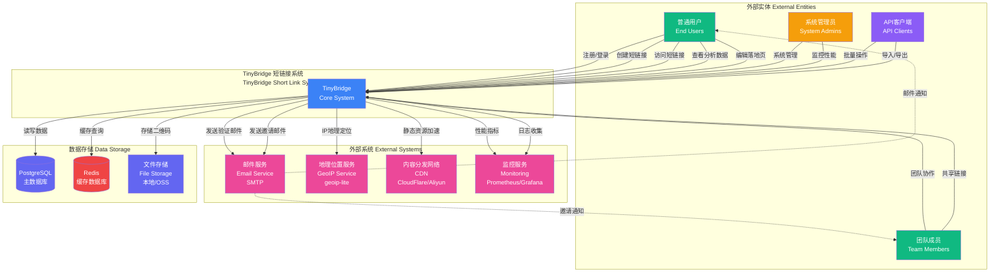

# Picture 3-1: Context Model Diagram
# 图 3-1:上下文模型图



## 上下文模型说明

### 🌐 系统边界定义

TinyBridge 短链接系统是一个**独立的 Web 应用程序**,通过 HTTP/HTTPS 协议为用户提供短链接生成、管理、分析和落地页编辑服务。

---

### 👥 外部实体 (External Entities)

#### 1. 普通用户 (End Users)

**角色定义**: 使用 TinyBridge 创建和管理短链接的个人用户。

**交互方式**:
- **注册/登录**: 通过邮箱 + 密码注册账号,登录后获得 JWT Token
- **创建短链接**: 提交长链接,获得自定义或随机生成的短链接
- **访问短链接**: 通过浏览器访问 `tinybridge.link/{code}`,重定向到目标 URL
- **查看分析数据**: 查看点击量、地理分布、设备类型等统计信息
- **编辑落地页**: 使用可视化编辑器或代码编辑器自定义落地页

**典型用例**:
```
场景: 学生社团活动推广
输入: https://example.com/scnu-programming-competition-2025
输出: https://tinybridge.link/scnu2025
用途: 在海报、微信群中分享,跟踪访问来源
```

---

#### 2. 团队成员 (Team Members)

**角色定义**: 加入团队的用户,与其他成员协作管理共享链接。

**交互方式**:
- **团队协作**: 接受邀请加入团队,查看团队成员
- **共享链接**: 创建归属于团队的短链接,团队成员共同管理
- **权限管理**: 根据角色 (Owner/Admin/Member) 拥有不同权限

**典型用例**:
```
场景: 营销团队活动
团队: "SCNU 学生会" (5 名成员)
共享链接: 10 个活动推广链接
协作: 成员 A 创建链接,成员 B 查看数据,成员 C 编辑落地页
```

---

#### 3. 系统管理员 (System Admins)

**角色定义**: 负责系统运维、监控和管理的技术人员。

**交互方式**:
- **系统管理**: 管理用户、审核恶意链接、处理举报
- **监控性能**: 查看系统负载、响应时间、错误率
- **数据库维护**: 备份数据、优化查询、清理过期数据

**管理工具**:
- Prometheus + Grafana 监控面板
- PostgreSQL 数据库管理工具
- Redis CLI 缓存管理

---

#### 4. API 客户端 (API Clients)

**角色定义**: 通过 API 接口与系统交互的第三方应用或脚本。

**交互方式**:
- **批量操作**: 通过 API 批量创建、更新、删除短链接
- **导入/导出**: 批量导入 CSV 文件,导出分析数据

**API 认证**:
```http
POST /api/batch/links
Authorization: Bearer {api_key}
Content-Type: application/json

{
  "links": [
    {"original_url": "https://example.com/1", "custom_code": "link1"},
    {"original_url": "https://example.com/2", "custom_code": "link2"}
  ]
}
```

**使用场景**:
- 电商平台批量生成商品推广链接
- 自动化脚本定期导出分析数据

---

### 🔌 外部系统 (External Systems)

#### 1. 邮件服务 (Email Service - SMTP)

**服务提供商**: SendGrid / Mailgun / 阿里云邮件推送

**交互场景**:
| 场景 | 触发条件 | 邮件内容 |
|------|----------|----------|
| **注册验证** | 用户注册 | 包含 6 位验证码的验证邮件 |
| **密码重置** | 用户忘记密码 | 包含重置链接的邮件 |
| **团队邀请** | 管理员邀请成员 | 包含邀请链接的邮件 |
| **每周报告** | 每周一凌晨 | 上周链接访问统计报告 |

**配置示例**:
```typescript
const emailConfig = {
  host: 'smtp.sendgrid.net',
  port: 587,
  auth: {
    user: 'apikey',
    pass: process.env.SENDGRID_API_KEY
  }
}
```

---

#### 2. 地理位置服务 (GeoIP Service)

**实现方式**: `geoip-lite` (本地数据库,无需外部 API 调用)

**功能**:
- 根据 IP 地址解析国家、省份、城市
- 支持离线查询,响应时间 < 1ms

**使用示例**:
```typescript
import geoip from 'geoip-lite'

const ip = '220.181.38.148'
const geo = geoip.lookup(ip)

console.log(geo)
// {
//   country: 'CN',
//   region: 'GD',
//   city: 'Guangzhou',
//   ll: [23.1167, 113.25]
// }
```

**数据来源**: MaxMind GeoLite2 数据库 (每月更新)

---

#### 3. 内容分发网络 (CDN)

**服务提供商**: CloudFlare / 阿里云 CDN / 腾讯云 CDN

**加速内容**:
- 静态资源 (JS/CSS/图片)
- 二维码图片
- 落地页 HTML

**配置**:
```nginx
# Nginx 配置
location ~* \.(js|css|png|jpg|jpeg|gif|svg|woff|woff2)$ {
  expires 1y;
  add_header Cache-Control "public, immutable";
}
```

**性能提升**:
- 全球访问延迟 < 100ms
- 减少源站带宽 70%

---

#### 4. 监控服务 (Monitoring)

**技术栈**: Prometheus (指标收集) + Grafana (可视化)

**监控指标**:
| 指标类型 | 具体指标 | 告警阈值 |
|----------|----------|----------|
| **应用性能** | 请求响应时间 | > 500ms |
| **系统资源** | CPU 使用率 | > 80% |
| **数据库** | 连接池使用率 | > 90% |
| **缓存** | Redis 内存使用率 | > 85% |
| **业务指标** | 短链接创建失败率 | > 1% |
| **错误率** | 5xx 错误率 | > 0.5% |

**告警通知**:
- 钉钉机器人 / 企业微信
- 短信通知 (严重故障)

---

### 💾 数据存储 (Data Storage)

#### 1. PostgreSQL (主数据库)

**用途**: 持久化存储所有业务数据

**数据表**:
- `users` - 用户账号
- `short_links` - 短链接
- `click_logs` - 点击日志
- `landing_pages` - 落地页
- `teams` - 团队
- `team_members` - 团队成员
- `api_keys` - API 密钥

**高可用配置**:
- 主从复制 (Master-Replica)
- 自动故障切换 (Patroni)
- 定期备份 (每日全量 + 每小时增量)

---

#### 2. Redis (缓存数据库)

**用途**: 高速缓存,减少数据库查询

**缓存数据**:
| Key 格式 | 数据内容 | TTL |
|----------|----------|-----|
| `link:{short_code}` | 原始 URL | 24h |
| `user:profile:{user_id}` | 用户资料 | 1h |
| `analytics:{link_id}:range:{start}-{end}` | 分析数据 | 1h |
| `session:{user_id}` | JWT Token 哈希 | 7d |
| `invite:{code}` | 团队邀请信息 | 7d |

**集群配置**:
- Redis Cluster (3 主 3 从)
- 持久化: AOF + RDB

---

#### 3. 文件存储 (File Storage)

**用途**: 存储二维码图片、用户头像等静态文件

**实现方式**:
- **开发环境**: 本地文件系统
- **生产环境**: 阿里云 OSS / AWS S3

**存储结构**:
```
/storage
├── qrcodes/
│   ├── abc123.png
│   └── xyz789.png
├── avatars/
│   └── user_12345.jpg
└── exports/
    └── analytics_2025-01-10.csv
```

---

### 🔄 数据流说明

#### 用户访问短链接流程

```
1. 用户在浏览器输入 https://tinybridge.link/abc123
2. 请求到达 CDN (CloudFlare)
3. CDN 转发到 TinyBridge 应用服务器
4. 应用查询 Redis 缓存
   - 缓存命中: 直接返回原始 URL
   - 缓存未命中: 查询 PostgreSQL,写入 Redis
5. 异步记录点击日志:
   - 提取 IP 地址
   - 调用 geoip-lite 解析地理位置
   - IP 哈希 (SHA256 + Salt)
   - 写入 PostgreSQL click_logs 表
6. 返回 302 重定向到原始 URL
7. 用户浏览器跳转到目标网站
```

**响应时间**: < 100ms (缓存命中 < 10ms)

---

### 📊 系统容量规划

| 指标 | 设计容量 | 峰值容量 |
|------|----------|----------|
| **用户数** | 10,000 | 50,000 |
| **短链接数** | 1,000,000 | 5,000,000 |
| **日访问量** | 100,000 | 500,000 |
| **并发请求** | 1,000 req/s | 5,000 req/s |
| **数据库大小** | 10 GB | 100 GB |
| **Redis 缓存** | 4 GB | 16 GB |

---

### 🔒 安全边界

| 边界 | 安全措施 |
|------|----------|
| **用户 ↔ 系统** | HTTPS 加密 + JWT 认证 |
| **API 客户端 ↔ 系统** | API Key 认证 + 速率限制 |
| **系统 ↔ 数据库** | 内网访问 + 密码认证 |
| **系统 ↔ Redis** | 密码认证 + ACL 权限控制 |
| **系统 ↔ 邮件服务** | TLS 加密 + API Key |

---

### 🌍 部署架构

```
[用户浏览器]
    ↓ HTTPS
[CloudFlare CDN]
    ↓
[Nginx 负载均衡器]
    ↓ (Round Robin)
[TinyBridge 应用服务器] x3 (Docker 容器)
    ↓
[PostgreSQL 主从集群]
[Redis 集群]
[阿里云 OSS]
```

**服务器配置** (生产环境):
- **应用服务器**: 2 核 4GB x 3 台
- **PostgreSQL**: 4 核 8GB + 100GB SSD
- **Redis**: 2 核 4GB
- **Nginx**: 2 核 2GB

---

### 📈 扩展性设计

| 扩展方向 | 实现方式 |
|----------|----------|
| **水平扩展** | 无状态应用服务器,支持动态增减实例 |
| **数据库扩展** | 读写分离,分库分表 (按 user_id 分片) |
| **缓存扩展** | Redis Cluster 动态增加节点 |
| **存储扩展** | 对象存储 (OSS) 自动扩容 |
