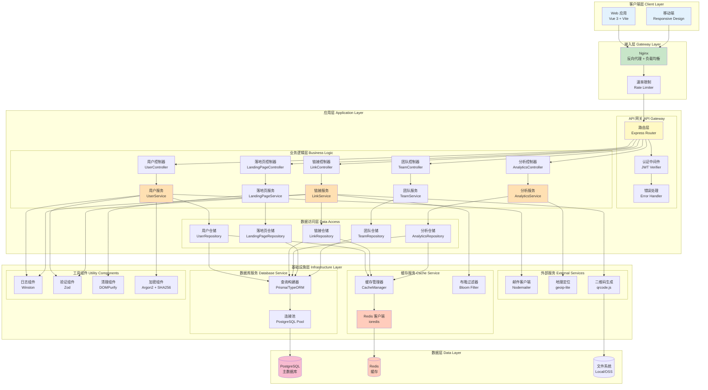

# Picture 3-2: Component Diagram
# 图 3-2:组件图



## 组件架构说明

### 📦 组件职责划分

---

### 1️⃣ 客户端层 (Client Layer)

#### Web 应用 (Vue 3 + Vite)

**技术栈**:
- Vue 3 (Composition API)
- Vue Router 4
- Pinia (状态管理)
- TailwindCSS (样式)

**核心功能**:
- 用户界面渲染
- 用户交互处理
- 状态管理
- 路由控制

**组件结构**:
```
src/
├── views/        # 页面组件
├── components/   # 通用组件
├── stores/       # Pinia 状态
├── services/     # API 服务
└── utils/        # 工具函数
```

---

#### 移动端 (Responsive Design)

**实现方式**: 响应式设计,无需单独开发

**适配策略**:
```css
/* TailwindCSS 响应式断点 */
sm: 640px   /* 手机横屏 */
md: 768px   /* 平板 */
lg: 1024px  /* 桌面 */
xl: 1280px  /* 大屏 */
```

---

### 2️⃣ 接入层 (Gateway Layer)

#### Nginx (反向代理 + 负载均衡)

**配置示例**:
```nginx
upstream tinybridge_backend {
    least_conn;  # 最少连接算法
    server app1:3000 weight=1;
    server app2:3000 weight=1;
    server app3:3000 weight=1;
}

server {
    listen 443 ssl http2;
    server_name tinybridge.link;

    ssl_certificate /etc/ssl/cert.pem;
    ssl_certificate_key /etc/ssl/key.pem;

    location / {
        proxy_pass http://tinybridge_backend;
        proxy_set_header X-Real-IP $remote_addr;
        proxy_set_header X-Forwarded-For $proxy_add_x_forwarded_for;
    }
}
```

**功能**:
- HTTPS 加密
- 负载均衡 (3 台应用服务器)
- 静态文件缓存
- Gzip 压缩

---

#### 速率限制 (Rate Limiter)

**实现方式**: Redis + Sliding Window 算法

```typescript
import { RateLimiterRedis } from 'rate-limiter-flexible'

const rateLimiter = new RateLimiterRedis({
  storeClient: redisClient,
  keyPrefix: 'ratelimit',
  points: 100,          // 100 次请求
  duration: 60,         // 每 60 秒
  blockDuration: 300    // 超限后封禁 5 分钟
})

// 中间件
async function rateLimitMiddleware(req, res, next) {
  try {
    await rateLimiter.consume(req.ip)
    next()
  } catch (error) {
    res.status(429).json({ error: 'Too Many Requests' })
  }
}
```

**限流策略**:
| 用户类型 | 限制 | 说明 |
|----------|------|------|
| **匿名用户** | 10 req/min | 仅允许访问短链接 |
| **普通用户** | 100 req/min | 正常使用 |
| **API 客户端** | 1,000 req/hour | 批量操作 |

---

### 3️⃣ 应用层 (Application Layer)

#### API 网关组件

**路由层 (Express Router)**:
```typescript
import express from 'express'

const app = express()

// 公开路由
app.get('/:short_code', redirectController.redirect)

// 认证路由
app.post('/api/auth/register', authController.register)
app.post('/api/auth/login', authController.login)

// 受保护路由
app.use('/api', authMiddleware)
app.get('/api/links', linkController.getLinks)
app.post('/api/links', linkController.createLink)
```

**认证中间件 (JWT Verifier)**:
```typescript
import jwt from 'jsonwebtoken'

async function authMiddleware(req, res, next) {
  const token = req.headers.authorization?.split(' ')[1]

  if (!token) {
    return res.status(401).json({ error: 'Unauthorized' })
  }

  try {
    const decoded = jwt.verify(token, process.env.JWT_SECRET)
    req.user = decoded
    next()
  } catch (error) {
    return res.status(401).json({ error: 'Invalid token' })
  }
}
```

**错误处理 (Error Handler)**:
```typescript
function errorHandler(err, req, res, next) {
  logger.error('Error:', err)

  if (err instanceof ValidationError) {
    return res.status(400).json({ error: err.message })
  }

  if (err instanceof NotFoundError) {
    return res.status(404).json({ error: err.message })
  }

  res.status(500).json({ error: 'Internal Server Error' })
}

app.use(errorHandler)
```

---

#### 业务逻辑层组件

**三层架构**:
```
Controller (控制器)
    ↓ 调用
Service (服务层)
    ↓ 调用
Repository (仓储层)
```

**示例: LinkController**:
```typescript
class LinkController {
  async createLink(req, res) {
    try {
      const userId = req.user.user_id
      const { original_url, custom_code } = req.body

      const link = await linkService.createLink(userId, {
        original_url,
        custom_code
      })

      res.status(201).json({ link })
    } catch (error) {
      next(error)
    }
  }
}
```

**示例: LinkService**:
```typescript
class LinkService {
  async createLink(userId, data) {
    // 1. 验证 URL
    if (!isValidUrl(data.original_url)) {
      throw new ValidationError('Invalid URL')
    }

    // 2. 生成短码
    const shortCode = data.custom_code || generateShortCode()

    // 3. 检查冲突
    const exists = await this.checkExists(shortCode)
    if (exists) {
      throw new ConflictError('Short code already exists')
    }

    // 4. 保存到数据库
    const link = await linkRepository.create({
      user_id: userId,
      original_url: data.original_url,
      short_code: shortCode
    })

    // 5. 缓存到 Redis
    await cacheManager.set(`link:${shortCode}`, data.original_url, 24 * 3600)

    return link
  }
}
```

**示例: LinkRepository**:
```typescript
class LinkRepository {
  async create(data) {
    const query = `
      INSERT INTO short_links (user_id, original_url, short_code, created_at)
      VALUES ($1, $2, $3, NOW())
      RETURNING *
    `
    const result = await db.query(query, [
      data.user_id,
      data.original_url,
      data.short_code
    ])

    return result.rows[0]
  }

  async findByShortCode(shortCode) {
    const query = `
      SELECT * FROM short_links
      WHERE short_code = $1 AND is_active = true
    `
    const result = await db.query(query, [shortCode])
    return result.rows[0]
  }
}
```

---

### 4️⃣ 基础设施层 (Infrastructure Layer)

#### 缓存服务组件

**Redis 客户端 (ioredis)**:
```typescript
import Redis from 'ioredis'

const redisClient = new Redis({
  host: process.env.REDIS_HOST,
  port: 6379,
  password: process.env.REDIS_PASSWORD,
  db: 0,
  retryStrategy: (times) => {
    return Math.min(times * 50, 2000)
  }
})
```

**缓存管理器 (CacheManager)**:
```typescript
class CacheManager {
  async get(key) {
    const value = await redisClient.get(key)
    return value ? JSON.parse(value) : null
  }

  async set(key, value, ttl) {
    await redisClient.set(key, JSON.stringify(value), 'EX', ttl)
  }

  async del(key) {
    await redisClient.del(key)
  }

  async keys(pattern) {
    return await redisClient.keys(pattern)
  }
}
```

**布隆过滤器 (Bloom Filter)**:
```typescript
import { BloomFilter } from 'bloom-filters'

const bloomFilter = new BloomFilter({
  size: 10000000,
  falsePositiveRate: 0.01
})

// 初始化: 加载所有已存在的短码
async function initBloomFilter() {
  const links = await linkRepository.getAllShortCodes()
  links.forEach(code => bloomFilter.add(code))
}
```

---

#### 数据库服务组件

**连接池 (PostgreSQL Pool)**:
```typescript
import { Pool } from 'pg'

const dbPool = new Pool({
  host: process.env.DB_HOST,
  port: 5432,
  database: process.env.DB_NAME,
  user: process.env.DB_USER,
  password: process.env.DB_PASSWORD,
  max: 20,              // 最大连接数
  idleTimeoutMillis: 30000,
  connectionTimeoutMillis: 2000
})
```

**查询构建器 (Prisma)**:
```typescript
import { PrismaClient } from '@prisma/client'

const prisma = new PrismaClient({
  log: ['query', 'error', 'warn']
})

// 使用示例
const link = await prisma.shortLink.create({
  data: {
    user_id: userId,
    original_url: originalUrl,
    short_code: shortCode
  }
})
```

---

#### 外部服务组件

**邮件客户端 (Nodemailer)**:
```typescript
import nodemailer from 'nodemailer'

const emailClient = nodemailer.createTransport({
  host: 'smtp.sendgrid.net',
  port: 587,
  auth: {
    user: 'apikey',
    pass: process.env.SENDGRID_API_KEY
  }
})

async function sendEmail(to, subject, html) {
  await emailClient.sendMail({
    from: 'noreply@tinybridge.link',
    to,
    subject,
    html
  })
}
```

**地理定位 (geoip-lite)**:
```typescript
import geoip from 'geoip-lite'

function getLocation(ip) {
  const geo = geoip.lookup(ip)
  return {
    country: geo?.country || 'Unknown',
    city: geo?.city || 'Unknown',
    latitude: geo?.ll?.[0],
    longitude: geo?.ll?.[1]
  }
}
```

**二维码生成 (qrcode.js)**:
```typescript
import QRCode from 'qrcode'

async function generateQRCode(url) {
  const options = {
    errorCorrectionLevel: 'M',
    type: 'image/png',
    width: 300
  }
  return await QRCode.toDataURL(url, options)
}
```

---

#### 工具组件

**日志组件 (Winston)**:
```typescript
import winston from 'winston'

const logger = winston.createLogger({
  level: 'info',
  format: winston.format.json(),
  transports: [
    new winston.transports.File({ filename: 'error.log', level: 'error' }),
    new winston.transports.File({ filename: 'combined.log' })
  ]
})
```

**验证组件 (Zod)**:
```typescript
import { z } from 'zod'

const createLinkSchema = z.object({
  original_url: z.string().url(),
  custom_code: z.string().regex(/^[a-zA-Z0-9]{4,12}$/).optional()
})

// 使用
const validated = createLinkSchema.parse(req.body)
```

**加密组件**:
```typescript
import argon2 from 'argon2'
import crypto from 'crypto'

// 密码哈希
async function hashPassword(password) {
  return await argon2.hash(password)
}

// IP 哈希
function hashIP(ip, salt) {
  return crypto.createHash('sha256').update(ip + salt).digest('hex')
}
```

---

### 🔄 组件交互流程

#### 创建短链接流程

```
1. 客户端 (Vue) 发起 POST /api/links
2. Nginx 转发请求到应用服务器
3. 速率限制检查 (100 req/min)
4. 路由层分发到 LinkController
5. 认证中间件验证 JWT Token
6. LinkController 调用 LinkService.createLink()
7. LinkService 调用验证组件验证 URL
8. LinkService 生成短码,调用布隆过滤器检查冲突
9. LinkService 调用 LinkRepository.create() 保存数据
10. LinkRepository 通过查询构建器写入 PostgreSQL
11. LinkService 调用缓存管理器写入 Redis
12. 返回短链接对象到客户端
```

---

### 📊 组件性能指标

| 组件 | 响应时间 | 吞吐量 |
|------|----------|--------|
| **Nginx** | < 5ms | 10,000 req/s |
| **速率限制** | < 1ms | - |
| **JWT 验证** | < 2ms | - |
| **Redis 缓存** | < 1ms | 50,000 ops/s |
| **PostgreSQL** | < 10ms | 1,000 qps |
| **布隆过滤器** | < 0.1ms | 1,000,000 ops/s |

---

### 🔧 组件可替换性

| 组件 | 当前实现 | 可替换选项 |
|------|----------|-----------|
| **数据库** | PostgreSQL | MySQL, MongoDB |
| **缓存** | Redis | Memcached |
| **ORM** | Prisma | TypeORM, Sequelize |
| **Web 框架** | Express | Fastify, Koa |
| **日志** | Winston | Pino, Bunyan |
