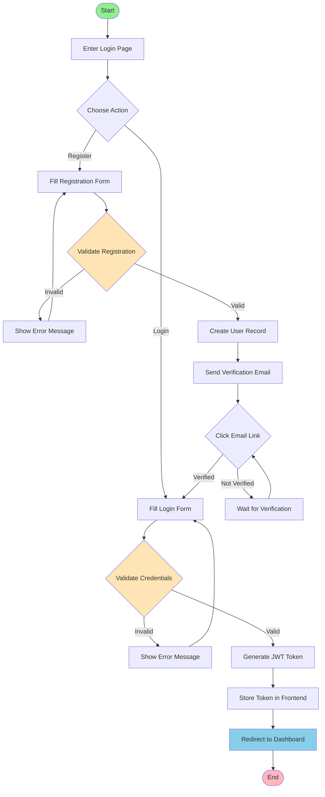

# Picture 2-1: Business Process Models of Login and Registration
# 图 2-1：登录与注册的业务流程模型图

## 流程说明

### 注册流程
1. 用户进入登录页面，选择注册
2. 填写注册表单（用户名、邮箱、密码）
3. 系统验证信息格式（邮箱格式、密码强度）
4. 验证成功后创建用户记录（密码使用 Argon2 哈希）
5. 发送验证邮件到用户邮箱
6. 用户点击邮件中的验证链接
7. 账户激活，返回登录页面

### 登录流程
1. 用户填写登录表单（邮箱/用户名 + 密码）
2. 系统验证凭据（密码哈希比对）
3. 验证成功后生成 JWT Token（Access Token 24h + Refresh Token 7d）
4. Token 存储到前端 LocalStorage
5. 跳转到控制台主页

### 错误处理
- 注册信息验证失败：重新填写
- 登录凭据错误：显示错误提示，限制每小时 5 次失败尝试
