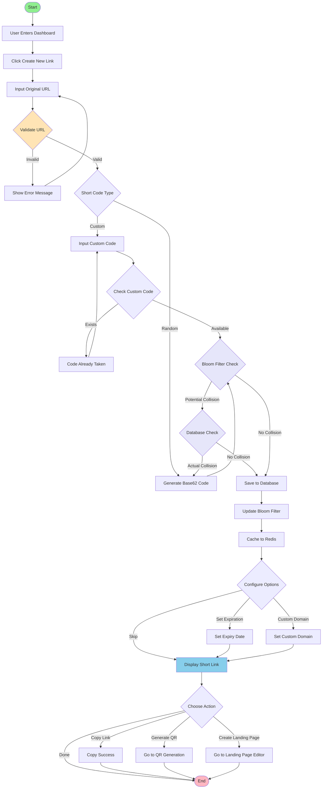

# Picture 2-4: Business Process Models of Short Link Creation and Management
# 图 2-4：短链接创建与管理的业务流程模型图

## 流程说明

### 短链接创建流程
1. **输入原始 URL**：用户在表单中输入需要缩短的 URL
2. **URL 验证**：检查 URL 格式是否合法（支持 HTTP/HTTPS）
3. **短码生成**：
   - **随机生成**：使用 Base62 算法生成 6-8 位短码（包含 0-9, a-z, A-Z）
   - **自定义短码**：用户指定自己的短码（需检查可用性）
4. **冲突检测**：
   - 先通过 **Bloom Filter** 快速检查（O(1) 时间复杂度）
   - 如有潜在冲突，再查询数据库确认
   - 若确实冲突，重新生成短码
5. **数据存储**：
   - 保存到 **PostgreSQL** 数据库
   - 更新 **Bloom Filter**
   - 缓存到 **Redis**（TTL 24h）
6. **配置选项**：
   - 设置过期时间（可选）
   - 配置自定义域名（可选）
7. **展示结果**：显示生成的短链接，提供复制、QR 码生成、落地页创建等操作

### 关键技术点
- **Base62 编码**：62 个字符（0-9, a-z, A-Z），6 位可支持 568 亿个短码
- **Bloom Filter**：误判率 < 0.01%，大幅减少数据库查询
- **Redis 缓存**：确保重定向响应时间 < 100ms
- **冲突重试**：自动重新生成，无需用户干预
