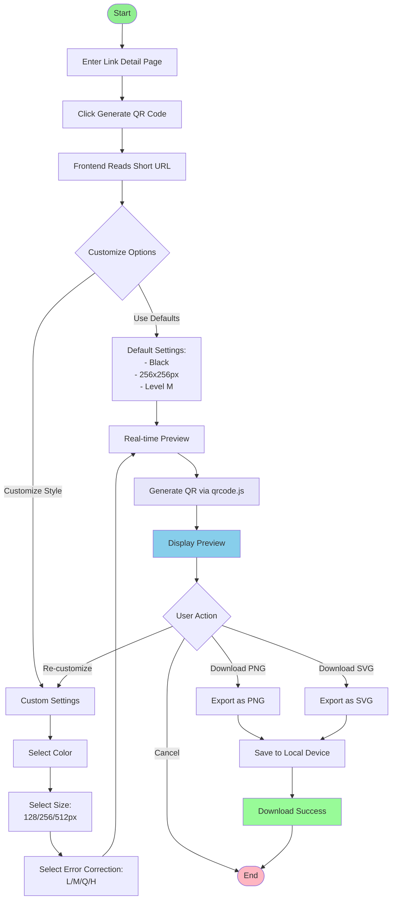

# Picture 2-7: Business Process Models of QR Code Generation
# 图 2-7：QR 码生成的业务流程模型图



## 流程说明

### QR 码生成流程（客户端实现）

#### 1. 触发生成
- 用户在短链接详情页点击"生成 QR 码"按钮
- 前端直接读取短链接 URL（如 `https://tinybridge.link/aB3xY9`）

#### 2. 自定义选项
用户可选择以下配置：

| 配置项 | 选项 | 说明 |
|--------|------|------|
| **颜色** | 黑色/蓝色/红色/自定义 | QR 码前景色 |
| **尺寸** | 128×128 / 256×256 / 512×512 | 像素尺寸 |
| **纠错级别** | L (7%) / M (15%) / Q (25%) / H (30%) | 容错能力 |

#### 3. 实时预览
- 使用 **qrcode.js** 或 **vue-qrcode** 库
- 在浏览器中即时生成 QR 码（无需后端）
- 显示预览图，支持实时调整

#### 4. 下载导出
- **PNG 格式**：适用于网页、社交媒体
- **SVG 格式**：适用于印刷品、矢量编辑

### 技术优势

#### ✅ 客户端生成的好处
1. **零后端负载**：不占用服务器资源
2. **即时响应**：无需网络请求，< 1 秒生成
3. **隐私保护**：QR 码不存储在数据库
4. **动态更新**：修改短链接目标 URL 后，QR 码无需重新生成

#### ✅ QR 码特性
- **编码内容**：短链接 URL（非最终目标 URL）
- **有效期**：与短链接生命周期一致
- **更新机制**：
  ```
  用户扫码 → 访问短链接 → 后端重定向 → 最终目标 URL
  ```
  如果修改短链接的目标 URL，已生成的 QR 码仍然有效

### 使用示例

```javascript
// 前端生成 QR 码示例
import QRCode from 'qrcode'

const shortURL = 'https://tinybridge.link/aB3xY9'
const canvas = document.getElementById('qr-canvas')

QRCode.toCanvas(canvas, shortURL, {
  width: 256,
  color: {
    dark: '#1E3A8A',  // 前景色
    light: '#FFFFFF'  // 背景色
  },
  errorCorrectionLevel: 'M'
})
```

### 纠错级别说明

| 级别 | 容错率 | 适用场景 |
|------|--------|----------|
| **L** | 7% | 干净环境，短期使用 |
| **M** | 15% | 一般使用（推荐） |
| **Q** | 25% | 户外海报 |
| **H** | 30% | 易损环境，长期使用 |
