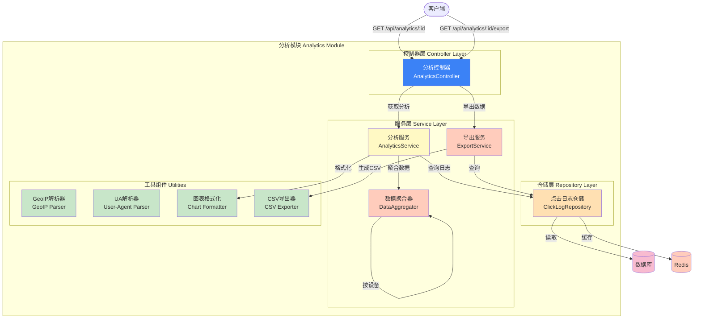

# Picture 3-10: Analytics Module Diagram
# 图 3-10:分析模块图



## 数据聚合维度

### 1. 时间趋势聚合
```sql
SELECT
  DATE_TRUNC('hour', clicked_at) as time_bucket,
  COUNT(*) as clicks
FROM click_logs
WHERE link_id = ? AND clicked_at BETWEEN ? AND ?
GROUP BY time_bucket
ORDER BY time_bucket
```

### 2. 地理分布聚合
```sql
SELECT
  country,
  city,
  COUNT(*) as clicks
FROM click_logs
WHERE link_id = ?
GROUP BY country, city
ORDER BY clicks DESC
LIMIT 20
```

### 3. 设备类型聚合
```sql
SELECT
  device_type,
  COUNT(*) as clicks
FROM click_logs
WHERE link_id = ?
GROUP BY device_type
```

## API 端点

| 方法 | 路径 | 说明 |
|------|------|------|
| GET | /api/analytics/:id | 获取链接分析数据 |
| GET | /api/analytics/:id/realtime | 获取实时统计 |
| GET | /api/analytics/:id/export | 导出CSV/JSON |
