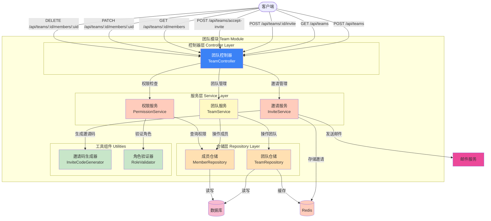

# Picture 3-14: Team Module Diagram
# 图 3-14:团队模块图

## 角色权限

| 角色 | 邀请成员 | 移除成员 | 修改角色 | 删除团队 |
|------|----------|----------|----------|----------|
| Owner | ✅ | ✅ | ✅ | ✅ |
| Admin | ✅ | ✅ | ❌ | ❌ |
| Member | ❌ | ❌ | ❌ | ❌ |

## API 端点

| 方法 | 路径 | 说明 |
|------|------|------|
| POST | /api/teams | 创建团队 |
| GET | /api/teams | 获取用户团队列表 |
| POST | /api/teams/:id/invite | 邀请成员 |
| POST | /api/teams/accept-invite | 接受邀请 |
| GET | /api/teams/:id/members | 获取团队成员 |
| PATCH | /api/teams/:id/members/:uid | 更新成员角色 |
| DELETE | /api/teams/:id/members/:uid | 移除成员 |
| DELETE | /api/teams/:id | 删除团队 |
