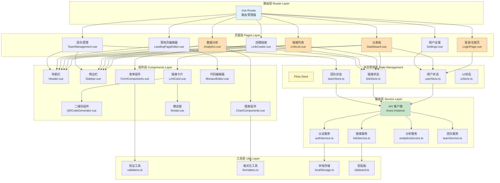

# Picture 3-16: Frontend Structure Diagram
# 图 3-16:前端结构图



## 前端架构说明

### 🏗️ 技术栈

| 层级 | 技术 | 说明 |
|------|------|------|
| **框架** | Vue 3 (Composition API) | 渐进式前端框架 |
| **构建工具** | Vite | 快速热更新,优化打包 |
| **路由** | Vue Router 4 | 单页应用路由管理 |
| **状态管理** | Pinia | 轻量级状态管理 |
| **UI 框架** | TailwindCSS + Headless UI | 原子化 CSS + 无样式组件 |
| **HTTP 客户端** | Axios | Promise 风格的 HTTP 库 |
| **图表库** | Chart.js | 数据可视化 |
| **代码编辑器** | Monaco Editor | VS Code 同款编辑器 |
| **表单验证** | Vuelidate / Zod | 响应式表单验证 |

---

### 📁 项目目录结构

```
src/
├── main.ts                 # 应用入口
├── App.vue                 # 根组件
├── router/                 # 路由配置
│   └── index.ts
├── views/                  # 页面组件
│   ├── auth/
│   │   ├── LoginPage.vue
│   │   └── RegisterPage.vue
│   ├── dashboard/
│   │   └── Dashboard.vue
│   ├── links/
│   │   ├── LinkList.vue
│   │   ├── LinkCreate.vue
│   │   └── LinkDetail.vue
│   ├── analytics/
│   │   └── Analytics.vue
│   ├── landing-pages/
│   │   └── LandingPageEditor.vue
│   ├── teams/
│   │   └── TeamManagement.vue
│   └── settings/
│       └── Settings.vue
├── components/             # 通用组件
│   ├── layout/
│   │   ├── Header.vue
│   │   ├── Sidebar.vue
│   │   └── Footer.vue
│   ├── common/
│   │   ├── Button.vue
│   │   ├── Input.vue
│   │   ├── Modal.vue
│   │   └── Toast.vue
│   ├── links/
│   │   ├── LinkCard.vue
│   │   └── QRCodeGenerator.vue
│   └── charts/
│       ├── LineChart.vue
│       ├── PieChart.vue
│       └── BarChart.vue
├── stores/                 # Pinia 状态管理
│   ├── user.ts
│   ├── link.ts
│   ├── team.ts
│   └── ui.ts
├── services/               # API 服务
│   ├── api.ts             # Axios 实例配置
│   ├── auth.ts
│   ├── link.ts
│   ├── analytics.ts
│   └── team.ts
├── composables/            # Vue 3 组合式函数
│   ├── useAuth.ts
│   ├── useClipboard.ts
│   └── useToast.ts
├── utils/                  # 工具函数
│   ├── validators.ts
│   ├── formatters.ts
│   └── storage.ts
├── types/                  # TypeScript 类型定义
│   ├── user.ts
│   ├── link.ts
│   └── team.ts
└── assets/                 # 静态资源
    ├── styles/
    │   └── global.css
    └── images/
```

---

### 1️⃣ 路由配置

```typescript
// router/index.ts
import { createRouter, createWebHistory } from 'vue-router'
import { useUserStore } from '@/stores/user'

const routes = [
  {
    path: '/login',
    name: 'Login',
    component: () => import('@/views/auth/LoginPage.vue'),
    meta: { requiresAuth: false }
  },
  {
    path: '/',
    name: 'Dashboard',
    component: () => import('@/views/dashboard/Dashboard.vue'),
    meta: { requiresAuth: true }
  },
  {
    path: '/links',
    name: 'LinkList',
    component: () => import('@/views/links/LinkList.vue'),
    meta: { requiresAuth: true }
  },
  {
    path: '/links/create',
    name: 'LinkCreate',
    component: () => import('@/views/links/LinkCreate.vue'),
    meta: { requiresAuth: true }
  },
  {
    path: '/links/:id/analytics',
    name: 'Analytics',
    component: () => import('@/views/analytics/Analytics.vue'),
    meta: { requiresAuth: true }
  },
  {
    path: '/links/:id/landing-page',
    name: 'LandingPageEditor',
    component: () => import('@/views/landing-pages/LandingPageEditor.vue'),
    meta: { requiresAuth: true }
  },
  {
    path: '/teams',
    name: 'Teams',
    component: () => import('@/views/teams/TeamManagement.vue'),
    meta: { requiresAuth: true }
  },
  {
    path: '/settings',
    name: 'Settings',
    component: () => import('@/views/settings/Settings.vue'),
    meta: { requiresAuth: true }
  }
]

const router = createRouter({
  history: createWebHistory(),
  routes
})

// 路由守卫
router.beforeEach((to, from, next) => {
  const userStore = useUserStore()

  if (to.meta.requiresAuth && !userStore.isAuthenticated) {
    next({ name: 'Login', query: { redirect: to.fullPath } })
  } else if (to.name === 'Login' && userStore.isAuthenticated) {
    next({ name: 'Dashboard' })
  } else {
    next()
  }
})

export default router
```

---

### 2️⃣ 状态管理 (Pinia)

```typescript
// stores/user.ts
import { defineStore } from 'pinia'
import { ref, computed } from 'vue'
import type { User } from '@/types/user'
import { authService } from '@/services/auth'

export const useUserStore = defineStore('user', () => {
  const user = ref<User | null>(null)
  const token = ref<string | null>(localStorage.getItem('token'))

  const isAuthenticated = computed(() => !!token.value)

  async function login(email: string, password: string) {
    const response = await authService.login(email, password)
    token.value = response.token
    user.value = response.user
    localStorage.setItem('token', response.token)
  }

  function logout() {
    token.value = null
    user.value = null
    localStorage.removeItem('token')
  }

  async function fetchProfile() {
    if (!token.value) return
    const profile = await authService.getProfile()
    user.value = profile
  }

  return {
    user,
    token,
    isAuthenticated,
    login,
    logout,
    fetchProfile
  }
})
```

```typescript
// stores/link.ts
import { defineStore } from 'pinia'
import { ref } from 'vue'
import type { ShortLink } from '@/types/link'
import { linkService } from '@/services/link'

export const useLinkStore = defineStore('link', () => {
  const links = ref<ShortLink[]>([])
  const currentLink = ref<ShortLink | null>(null)
  const loading = ref(false)

  async function fetchLinks(page = 1, limit = 10) {
    loading.value = true
    try {
      const response = await linkService.getLinks({ page, limit })
      links.value = response.links
    } finally {
      loading.value = false
    }
  }

  async function createLink(data: { original_url: string; custom_code?: string }) {
    const newLink = await linkService.createLink(data)
    links.value.unshift(newLink)
    return newLink
  }

  async function deleteLink(linkId: number) {
    await linkService.deleteLink(linkId)
    links.value = links.value.filter(link => link.id !== linkId)
  }

  return {
    links,
    currentLink,
    loading,
    fetchLinks,
    createLink,
    deleteLink
  }
})
```

---

### 3️⃣ API 服务层

```typescript
// services/api.ts
import axios from 'axios'
import { useUserStore } from '@/stores/user'
import router from '@/router'

const api = axios.create({
  baseURL: import.meta.env.VITE_API_BASE_URL || 'http://localhost:3000/api',
  timeout: 10000
})

// 请求拦截器 - 添加 Token
api.interceptors.request.use(
  (config) => {
    const userStore = useUserStore()
    if (userStore.token) {
      config.headers.Authorization = `Bearer ${userStore.token}`
    }
    return config
  },
  (error) => Promise.reject(error)
)

// 响应拦截器 - 处理错误
api.interceptors.response.use(
  (response) => response.data,
  (error) => {
    if (error.response?.status === 401) {
      const userStore = useUserStore()
      userStore.logout()
      router.push({ name: 'Login' })
    }
    return Promise.reject(error)
  }
)

export default api
```

```typescript
// services/link.ts
import api from './api'
import type { ShortLink } from '@/types/link'

export const linkService = {
  async getLinks(params: { page: number; limit: number }) {
    return await api.get('/links', { params })
  },

  async createLink(data: { original_url: string; custom_code?: string }) {
    return await api.post('/links', data)
  },

  async updateLink(linkId: number, data: any) {
    return await api.patch(`/links/${linkId}`, data)
  },

  async deleteLink(linkId: number) {
    return await api.delete(`/links/${linkId}`)
  }
}
```

---

### 4️⃣ 组合式函数 (Composables)

```typescript
// composables/useClipboard.ts
import { ref } from 'vue'

export function useClipboard() {
  const copied = ref(false)

  async function copy(text: string) {
    try {
      await navigator.clipboard.writeText(text)
      copied.value = true
      setTimeout(() => {
        copied.value = false
      }, 2000)
      return true
    } catch (error) {
      console.error('Failed to copy:', error)
      return false
    }
  }

  return {
    copied,
    copy
  }
}
```

```typescript
// composables/useToast.ts
import { ref } from 'vue'

interface Toast {
  id: number
  message: string
  type: 'success' | 'error' | 'info'
}

const toasts = ref<Toast[]>([])
let id = 0

export function useToast() {
  function show(message: string, type: Toast['type'] = 'info') {
    const toast: Toast = {
      id: id++,
      message,
      type
    }
    toasts.value.push(toast)

    setTimeout(() => {
      toasts.value = toasts.value.filter(t => t.id !== toast.id)
    }, 3000)
  }

  return {
    toasts,
    show,
    success: (msg: string) => show(msg, 'success'),
    error: (msg: string) => show(msg, 'error'),
    info: (msg: string) => show(msg, 'info')
  }
}
```

---

### 5️⃣ 页面组件示例

```vue
<!-- views/links/LinkList.vue -->
<template>
  <div class="min-h-screen bg-gray-50">
    <Header />
    <div class="flex">
      <Sidebar />
      <main class="flex-1 p-8">
        <div class="max-w-6xl mx-auto">
          <div class="flex justify-between items-center mb-6">
            <h1 class="text-3xl font-bold text-gray-800">我的短链接</h1>
            <router-link
              to="/links/create"
              class="bg-blue-600 text-white px-4 py-2 rounded-lg hover:bg-blue-700"
            >
              创建新链接
            </router-link>
          </div>

          <div v-if="loading" class="text-center py-12">
            <div class="animate-spin rounded-full h-12 w-12 border-b-2 border-blue-600 mx-auto"></div>
          </div>

          <div v-else class="grid grid-cols-1 md:grid-cols-2 lg:grid-cols-3 gap-6">
            <LinkCard
              v-for="link in links"
              :key="link.id"
              :link="link"
              @delete="handleDelete"
            />
          </div>

          <div v-if="!loading && links.length === 0" class="text-center py-12">
            <p class="text-gray-500 text-lg">还没有创建任何短链接</p>
          </div>
        </div>
      </main>
    </div>
  </div>
</template>

<script setup lang="ts">
import { onMounted } from 'vue'
import { storeToRefs } from 'pinia'
import { useLinkStore } from '@/stores/link'
import { useToast } from '@/composables/useToast'
import Header from '@/components/layout/Header.vue'
import Sidebar from '@/components/layout/Sidebar.vue'
import LinkCard from '@/components/links/LinkCard.vue'

const linkStore = useLinkStore()
const { links, loading } = storeToRefs(linkStore)
const toast = useToast()

onMounted(() => {
  linkStore.fetchLinks()
})

async function handleDelete(linkId: number) {
  if (!confirm('确定要删除这个链接吗?')) return

  try {
    await linkStore.deleteLink(linkId)
    toast.success('链接已删除')
  } catch (error) {
    toast.error('删除失败,请重试')
  }
}
</script>
```

---

### 6️⃣ 通用组件示例

```vue
<!-- components/links/LinkCard.vue -->
<template>
  <div class="bg-white rounded-lg shadow-md p-6 hover:shadow-lg transition">
    <div class="flex justify-between items-start mb-4">
      <h3 class="text-lg font-semibold text-gray-800 truncate flex-1">
        {{ link.original_url }}
      </h3>
      <span
        :class="[
          'px-2 py-1 text-xs rounded',
          link.is_active ? 'bg-green-100 text-green-800' : 'bg-gray-100 text-gray-800'
        ]"
      >
        {{ link.is_active ? '活跃' : '已禁用' }}
      </span>
    </div>

    <div class="flex items-center gap-2 mb-4">
      <input
        :value="shortUrl"
        readonly
        class="flex-1 px-3 py-2 border rounded-lg bg-gray-50 text-sm"
      />
      <button
        @click="handleCopy"
        class="px-4 py-2 bg-blue-600 text-white rounded-lg hover:bg-blue-700"
      >
        {{ copied ? '已复制' : '复制' }}
      </button>
    </div>

    <div class="flex items-center justify-between text-sm text-gray-600">
      <span>点击数: {{ link.click_count }}</span>
      <span>{{ formatDate(link.created_at) }}</span>
    </div>

    <div class="mt-4 flex gap-2">
      <router-link
        :to="`/links/${link.id}/analytics`"
        class="flex-1 text-center px-3 py-2 border border-blue-600 text-blue-600 rounded-lg hover:bg-blue-50"
      >
        分析
      </router-link>
      <button
        @click="$emit('delete', link.id)"
        class="px-3 py-2 border border-red-600 text-red-600 rounded-lg hover:bg-red-50"
      >
        删除
      </button>
    </div>
  </div>
</template>

<script setup lang="ts">
import { computed } from 'vue'
import { useClipboard } from '@/composables/useClipboard'
import type { ShortLink } from '@/types/link'

const props = defineProps<{
  link: ShortLink
}>()

defineEmits<{
  delete: [id: number]
}>()

const { copied, copy } = useClipboard()

const shortUrl = computed(() => `https://tinybridge.link/${props.link.short_code}`)

function handleCopy() {
  copy(shortUrl.value)
}

function formatDate(date: string) {
  return new Date(date).toLocaleDateString('zh-CN')
}
</script>
```

---

### 🎨 TailwindCSS 配置

```javascript
// tailwind.config.js
export default {
  content: [
    './index.html',
    './src/**/*.{vue,js,ts,jsx,tsx}'
  ],
  theme: {
    extend: {
      colors: {
        primary: '#3B82F6',
        secondary: '#8B5CF6',
        success: '#10B981',
        warning: '#F59E0B',
        danger: '#EF4444'
      }
    }
  },
  plugins: []
}
```

---

### ⚡ 性能优化

| 策略 | 实现方式 |
|------|----------|
| **路由懒加载** | `() => import()` 动态导入 |
| **组件懒加载** | `defineAsyncComponent` |
| **图片懒加载** | `v-lazy` 指令 |
| **代码分割** | Vite 自动分割 |
| **缓存策略** | Service Worker (PWA) |
| **Tree Shaking** | Vite 自动优化 |
