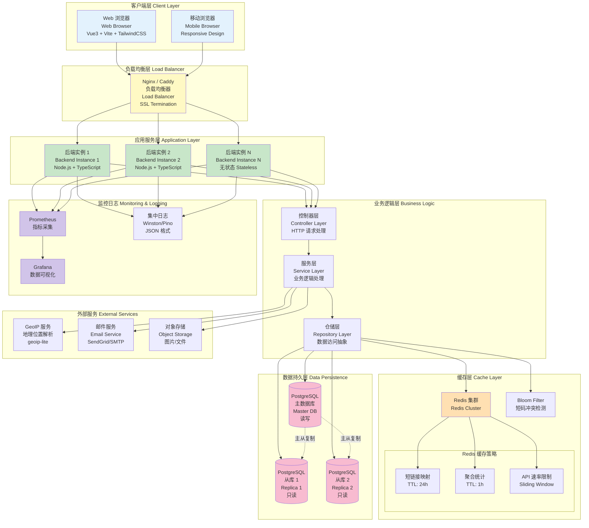

# Picture 3-3: The Architecture Diagram of TinyBridge Platform
# 图 3-3：TinyBridge 平台架构图



## 架构说明

### 🏗️ 分层架构

TinyBridge 采用**三层架构 + 微服务可扩展设计**，实现高可用、高性能的短链接服务。

---

### 1️⃣ 客户端层（Client Layer）

**技术栈：**
- **前端框架**：Vue 3（Composition API）
- **构建工具**：Vite（快速热更新）
- **UI 框架**：TailwindCSS + Headless UI
- **状态管理**：Pinia
- **HTTP 客户端**：Axios
- **图表库**：Chart.js / ECharts

**特性：**
- ✅ 单页应用（SPA）
- ✅ 响应式设计（Mobile-first）
- ✅ 代码分割（Lazy Loading）
- ✅ PWA 支持（Service Worker）

**通信方式：**
```
Browser → RESTful API (JSON)
      ↓
  HTTPS (TLS 1.3)
      ↓
Load Balancer
```

---

### 2️⃣ 负载均衡层（Load Balancer）

**技术选型：**
- **Nginx**（生产环境推荐）
- **Caddy**（自动 HTTPS）

**功能：**
1. **TLS 终止**：HTTPS → HTTP（后端）
2. **负载均衡算法**：
   - 轮询（Round Robin）
   - 最少连接（Least Connections）
3. **健康检查**：自动剔除故障实例
4. **静态资源缓存**：CSS/JS/图片

**配置示例（Nginx）：**
```nginx
upstream backend {
  least_conn;
  server 127.0.0.1:3001 weight=1;
  server 127.0.0.1:3002 weight=1;
  server 127.0.0.1:3003 weight=1;
}

server {
  listen 443 ssl http2;
  server_name tinybridge.link;

  ssl_certificate /path/to/cert.pem;
  ssl_certificate_key /path/to/key.pem;

  location / {
    proxy_pass http://backend;
    proxy_set_header X-Real-IP $remote_addr;
    proxy_set_header X-Forwarded-For $proxy_add_x_forwarded_for;
  }
}
```

---

### 3️⃣ 应用服务层（Application Layer）

**技术栈：**
- **运行时**：Node.js 18+ LTS
- **语言**：TypeScript
- **Web 框架**：Express / Fastify
- **ORM**：Prisma / TypeORM

**架构模式：**
```
┌─────────────────────────────────┐
│  Controller 层（控制器）         │
│  - 路由处理                      │
│  - 请求验证（Joi/Zod）          │
│  - 响应格式化                    │
└────────────┬────────────────────┘
             │
┌────────────▼────────────────────┐
│  Service 层（服务）              │
│  - 业务逻辑                      │
│  - 短码生成（Base62）            │
│  - 权限控制                      │
│  - 数据聚合                      │
└────────────┬────────────────────┘
             │
┌────────────▼────────────────────┐
│  Repository 层（仓储）           │
│  - 数据库 CRUD                   │
│  - 缓存读写                      │
│  - 事务管理                      │
└─────────────────────────────────┘
```

**无状态设计：**
- ❌ 不使用内存Session
- ✅ JWT Token 存储在客户端
- ✅ 所有状态存储在 Redis/PostgreSQL
- ✅ 支持水平扩展（Scale Out）

**实例数量：**
```
最小配置: 2 个实例（高可用）
推荐配置: 3-5 个实例（按流量弹性伸缩）
```

---

### 4️⃣ 缓存层（Cache Layer）

#### Redis 集群配置

**部署模式：**
- **主从复制（Master-Slave）**：1 主 2 从
- **哨兵模式（Sentinel）**：自动故障转移
- **集群模式（Cluster）**：超大规模（可选）

**缓存策略：**

| 缓存类型 | Key 格式 | TTL | 说明 |
|----------|----------|-----|------|
| **短链接映射** | `link:{short_code}` | 24h | 存储 `original_url` |
| **聚合统计** | `analytics:{link_id}:{range}` | 1h | 预计算的分析数据 |
| **API 速率限制** | `ratelimit:{api_key_hash}:{hour}` | 1h | 滑动窗口计数器 |
| **Bloom Filter** | `bloom:short_codes` | 永久 | 短码存在性检测 |

**性能数据：**
```
Redis GET:    < 1ms  （本地网络）
Redis SET:    < 2ms
缓存命中率:   > 95%
```

#### Bloom Filter 实现

```javascript
const { BloomFilter } = require('bloom-filters')

// 初始化 Bloom Filter
const bloomFilter = new BloomFilter({
  size: 10000000,           // 1000 万个元素
  falsePositiveRate: 0.01   // 1% 误判率
})

// 检查短码是否存在
async function checkShortCode(code) {
  if (!bloomFilter.has(code)) {
    return false  // 100% 不存在
  }
  // 可能存在，查询数据库确认
  return await db.shortLinks.exists({ short_code: code })
}
```

---

### 5️⃣ 数据持久层（Data Persistence）

#### PostgreSQL 主从架构

**配置：**
- **主库（Master）**：处理所有写操作 + 部分读操作
- **从库 1-N（Replicas）**：处理只读查询
- **同步方式**：异步流复制（Streaming Replication）

**读写分离：**
```javascript
// 写操作 → 主库
await masterDB.shortLinks.create({ ... })

// 读操作 → 从库（负载均衡）
const links = await replicaDB.shortLinks.findMany({ ... })
```

**备份策略：**
- **增量备份**：每天 02:00（WAL 归档）
- **全量备份**：每周日 00:00
- **保留策略**：增量 7 天，全量 4 周

**数据库表结构：**
```
users            (用户表)
teams            (团队表)
team_members     (团队成员关联表)
short_links      (短链接表)
click_logs       (点击日志表) ← 分区表
landing_pages    (落地页表)
api_keys         (API 密钥表)
```

---

### 6️⃣ 外部服务（External Services）

#### GeoIP 地理定位
```javascript
const geoip = require('geoip-lite')

const geo = geoip.lookup('8.8.8.8')
// {
//   range: [134744064, 134744319],
//   country: 'US',
//   region: 'CA',
//   city: 'Mountain View',
//   ll: [37.386, -122.0838]
// }
```

#### 邮件服务
- **SendGrid API**（推荐）
- **AWS SES**
- **自建 SMTP**

用途：
- 注册验证邮件
- 密码重置邮件
- 链接过期提醒

#### 对象存储
- **AWS S3** / **MinIO**
- 存储用户上传的图片（头像、落地页图片）
- CDN 加速

---

### 7️⃣ 监控日志（Monitoring & Logging）

#### Prometheus 监控指标

**系统指标：**
- CPU 使用率
- 内存使用率
- 磁盘 I/O

**应用指标：**
```javascript
// 自定义指标
const httpRequestDuration = new Histogram({
  name: 'http_request_duration_ms',
  help: 'HTTP 请求耗时（毫秒）',
  labelNames: ['method', 'route', 'status_code']
})

// 记录请求耗时
app.use((req, res, next) => {
  const start = Date.now()
  res.on('finish', () => {
    const duration = Date.now() - start
    httpRequestDuration
      .labels(req.method, req.route.path, res.statusCode)
      .observe(duration)
  })
  next()
})
```

**业务指标：**
- 短链接创建速率
- 重定向 QPS
- 缓存命中率
- API 调用次数

#### Grafana 仪表板

**关键面板：**
1. **流量监控**：实时 QPS 曲线
2. **性能监控**：P50/P95/P99 响应时间
3. **错误监控**：HTTP 4xx/5xx 错误率
4. **资源监控**：CPU/内存/磁盘使用率

#### 集中日志

**日志格式（JSON）：**
```json
{
  "timestamp": "2025-01-15T14:32:10.123Z",
  "level": "info",
  "message": "Short link created",
  "short_code": "aB3xY9",
  "user_id": 12345,
  "ip": "REDACTED",
  "trace_id": "7d8f4e2a-3b1c-9f6e..."
}
```

**日志级别：**
- `debug`：调试信息（生产环境关闭）
- `info`：正常操作
- `warn`：警告（如缓存未命中）
- `error`：错误（如数据库连接失败）

---

### ⚡ 性能目标

| 指标 | 目标值 |
|------|--------|
| **重定向响应时间** | < 100ms (P95) |
| **API 响应时间** | < 200ms (P95) |
| **并发处理能力** | 5,000 req/s |
| **可用性** | 99.5% |
| **缓存命中率** | > 95% |

---

### 🔒 安全措施

1. **HTTPS** 加密传输（TLS 1.3）
2. **JWT Token** 认证
3. **API Rate Limiting** 防滥用
4. **SQL Injection** 防护（ORM 参数化查询）
5. **XSS** 防护（DOMPurify 清理 HTML）
6. **CSRF** 防护（SameSite Cookie）
7. **IP 匿名化**（SHA256 哈希）

---

### 🚀 扩展性设计

#### 水平扩展
```
当前: 3 个后端实例
扩展: 添加更多实例 → 负载均衡器自动分发
```

#### 数据库扩展
```
读多写少: 增加从库数量
写压力大: 分库分表（按用户 ID）
```

#### 缓存扩展
```
Redis 单机 → Redis Cluster（分片）
```

#### 未来演进：微服务架构
```
┌─────────────┐
│ API Gateway │
└──────┬──────┘
       │
   ┌───┴────┬────────┬──────────┐
   │        │        │          │
┌──▼──┐ ┌──▼──┐ ┌───▼───┐ ┌───▼────┐
│User │ │Link │ │Analytics│ │Landing │
│Svc  │ │Svc  │ │  Svc   │ │ Page   │
│     │ │     │ │        │ │  Svc   │
└─────┘ └─────┘ └────────┘ └────────┘
```
