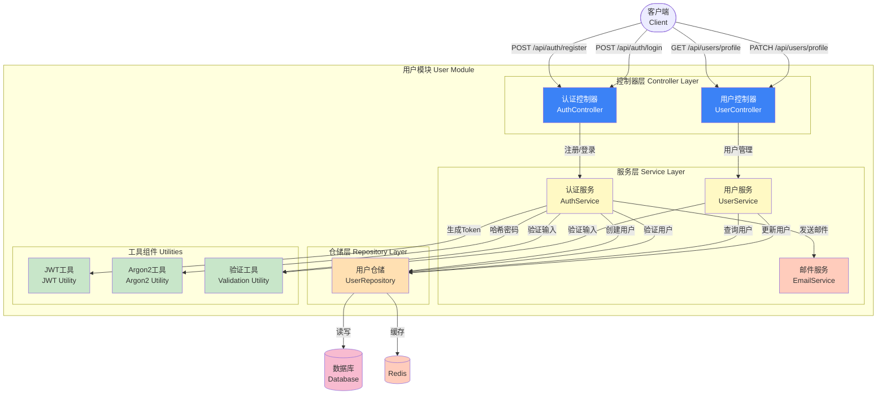

# Picture 3-6: User Module Diagram
# 图 3-6:用户模块图



## 模块职责

### AuthController (认证控制器)
**路由**:
- `POST /api/auth/register` - 用户注册
- `POST /api/auth/verify` - 验证邮箱
- `POST /api/auth/login` - 用户登录
- `POST /api/auth/logout` - 用户登出
- `POST /api/auth/refresh` - 刷新 Token

**职责**:
- 处理 HTTP 请求
- 验证输入格式
- 调用 AuthService
- 返回响应

---

### UserController (用户控制器)
**路由**:
- `GET /api/users/profile` - 获取用户资料
- `PATCH /api/users/profile` - 更新用户资料
- `PATCH /api/users/password` - 修改密码
- `DELETE /api/users/account` - 删除账号

---

### AuthService (认证服务)
**核心方法**:
```typescript
class AuthService {
  async register(data: RegisterDTO): Promise<User>
  async verifyEmail(userId: number, code: string): Promise<boolean>
  async login(email: string, password: string): Promise<{ token: string, user: User }>
  async logout(userId: number): Promise<void>
}
```

---

### UserService (用户服务)
**核心方法**:
```typescript
class UserService {
  async getProfile(userId: number): Promise<User>
  async updateProfile(userId: number, data: UpdateUserDTO): Promise<User>
  async changePassword(userId: number, oldPassword: string, newPassword: string): Promise<void>
  async deleteAccount(userId: number): Promise<void>
}
```

---

### UserRepository (用户仓储)
**核心方法**:
```typescript
class UserRepository {
  async create(data: CreateUserDTO): Promise<User>
  async findById(id: number): Promise<User | null>
  async findByEmail(email: string): Promise<User | null>
  async findByUsername(username: string): Promise<User | null>
  async update(id: number, data: Partial<User>): Promise<User>
  async delete(id: number): Promise<void>
}
```

---

## 核心工具

### JWTUtil - JWT 工具
```typescript
function generateToken(payload: object): string
function verifyToken(token: string): object
```

### Argon2Util - 密码哈希工具
```typescript
async function hashPassword(password: string): Promise<string>
async function verifyPassword(hash: string, password: string): Promise<boolean>
```

### ValidationUtil - 验证工具
```typescript
function validateEmail(email: string): boolean
function validatePassword(password: string): boolean
function validateUsername(username: string): boolean
```
