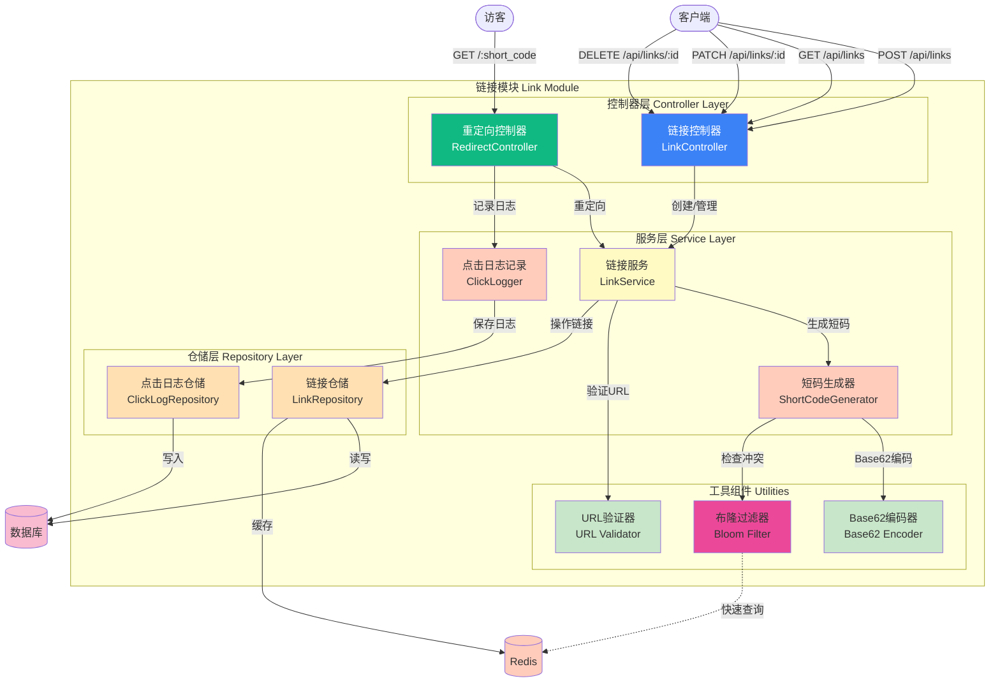

# Picture 3-8: Link Module Diagram
# 图 3-8:链接模块图



## 核心流程

### 1. 创建短链接
```
用户请求 → LinkController
    ↓
LinkService.createLink()
    ↓
URLValidator.validate(url)
    ↓
ShortCodeGenerator.generate()
    ├→ Base62Encoder.encode(id)
    └→ BloomFilter.check(code)
    ↓
LinkRepository.create()
    ├→ Database.insert()
    └→ Redis.cache()
```

### 2. 访问短链接
```
访客请求 → RedirectController
    ↓
LinkService.redirect(code)
    ↓
Redis.get(code)
    ├→ 缓存命中 → 返回URL
    └→ 缓存未命中
            ↓
        Database.query()
            ↓
        Redis.set(code, url)
            ↓
        返回URL
    ↓
异步: ClickLogger.log()
    ↓
返回 302 重定向
```

## 关键组件

### ShortCodeGenerator (短码生成器)
```typescript
class ShortCodeGenerator {
  generate(customCode?: string): string {
    if (customCode) {
      if (!this.validate(customCode)) throw new Error('Invalid code')
      if (this.bloomFilter.has(customCode)) throw new Error('Code exists')
      return customCode
    }

    let code: string
    let attempts = 0

    do {
      code = this.base62Encoder.encode(Date.now() + Math.random())
      attempts++
      if (attempts > 5) throw new Error('Failed to generate unique code')
    } while (this.bloomFilter.has(code))

    return code
  }
}
```

### BloomFilter (布隆过滤器)
```typescript
class BloomFilter {
  has(code: string): boolean {
    // O(1) 快速检测
    return this.filter.has(code)
  }

  add(code: string): void {
    this.filter.add(code)
  }
}
```

## API 端点

| 方法 | 路径 | 说明 |
|------|------|------|
| POST | /api/links | 创建短链接 |
| GET | /api/links | 获取链接列表 |
| GET | /api/links/:id | 获取单个链接详情 |
| PATCH | /api/links/:id | 更新链接 |
| DELETE | /api/links/:id | 删除链接 |
| GET | /:short_code | 重定向到原始URL |
